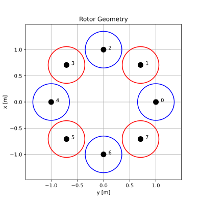
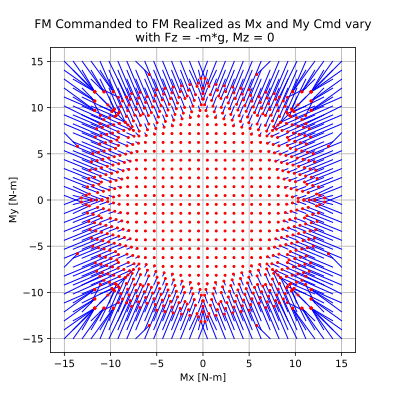
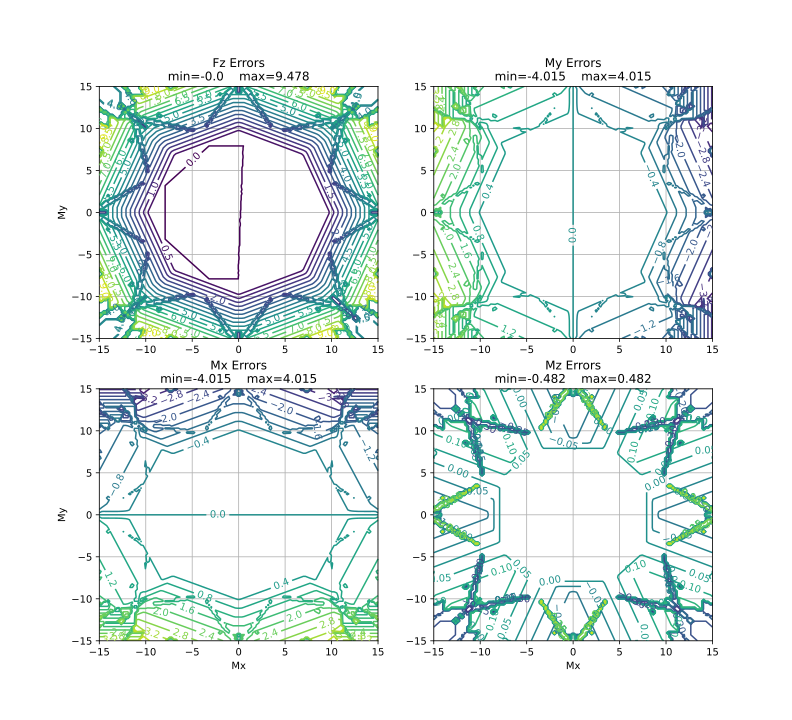

Control Allocation for an Octocopter
====================================

Multiparametric Optimization is important to many modern control strategies.
One basic strategy is known as Control Allocation.  This is the process of
determining a set of laws which optimally assign control signals to desired
plant output.  For an octocopter, this would mean optimally assigning the eight
motor throttle signals in order to get a desired total thrust and total roll,
pitch, and yaw moments.

There are two, typically competitive, objectives to consider when assigning the
control signals: 1. The error between the desired and actual thrust and total
roll, pitch, and yaw moments 2. Throttle signals are as low as possible in order
to minimize energy usage.

First we will define a vehicle model based on a simple octocopter with very
simple, constant, thrust coefficient, torque coefficient, and figure of merit.

.. code:: python

    import numpy as np

    # Vehicle Parameters
    m = 5.0  # Vehicle mass [kg]
    g = 9.8  # Gravitational acceleration [m/s^2]
    r = 0.35 # Rotor radius [m]
    rotDir = np.array([+1.0, -1.0, +1.0, -1.0, +1.0, -1.0, +1.0, -1.0], float)
        # positive is right handed rotation about thrust direction
    n = 8 # Number of rotors
    m = 4 # Number of control axes

    # Rotor locations in x forward, y right, z down coordinate frame at CG
    # Assumed to be axisymmetric about CG
    phi = np.linspace(0.0, 2.0*np.pi, n+1, True, False, float)
    phi = phi[0:-1] # Azimuth
    xRotor = np.sin(phi) # Rotor x location [m]
    yRotor = np.cos(phi) # Rotor y location [m]
    zRotor = np.zeros((n), float) # Rotor z location [m]

    # Rotor Parameters
    Ct = 0.014 # Thrust coefficient [T = rho*pi*r^4*Ct*omega^2]
    FoM = 0.7  # Figure of merit
    Cq = Ct**1.5/FoM/np.sqrt(2.0) # Torque coefficient [Q = rho*pi*r^5*Cq*omega^2]

    # Motor Sizing
    thrustRatio = 1.4 # Individual rotor maximum thrust over hover thrust

Now we must compute the model's control Jacobians in order to produce a linear
model.  This is essential because we must create quadratic forms for the
objective function.  Linear forms are needed now because we will form a squared
error term and a squared Euclidean distance term.

.. code:: python

    # Generate hover control Jacobian: dFM/dTau
    # Ignore Fx and Fy (assume no cant on rotors)
    dFMdTau = np.zeros((m, n), float)

    # Thrust per torque
    dTdTau = Ct/(r*Cq)

    # Fz = -dTdTau
    dFMdTau[0,:] = -dTdTau*np.ones((n), float)

    # Mx = dTdTau*-y
    dFMdTau[1,:] = -dTdTau*yRotor

    # My = dTdTau*x
    dFMdTau[2,:] = dTdTau*xRotor

    # Mz = rotDir
    dFMdTau[3,:] = rotDir

Next we compute a trim point which will be useful for the objective function.

.. code:: python

    # Force/Moment trim command, assuming CG is at origin 
    FMTrim = np.array([-m*g, 0.0, 0.0, 0.0], float) # 1g thrust, 0 moment commands

    # Compute trim actuation using Moore-Penrose pseudo-inverse
    xTrim = (np.linalg.pinv(dFMdTau)@FMTrim.reshape((4, 1))).reshape((n))

Now for the problem formulation.  The vehicle must be capable of responding to
any combination of thrust, roll moment, pitch moment, and yaw moment requested
from its control system (or pilot).  Our aim is to meet every possible request
optimally, so we must parameterize the optimization problem based on thrust,
roll, pitch, and yaw.  Let's therefore form the parameter (theta) vector:

.. math::

    FMCmd = \left[\begin{matrix} F_{thrust} \\ M_{roll} \\ M_{pitch} \\ M_{yaw} \end{matrix}\right]

We desire optimal selection of the motor throttle signals, so they will form the
decision variable vector:

.. math::

    x = \left[\begin{matrix} \delta_{motor 0} \\ \delta_{motor 1} \\ \delta_{motor 2} \\ \delta_{motor 3} \\ \delta_{motor 4} \\ \delta_{motor 5} \\ \delta_{motor 6} \\ \delta_{motor 7} \end{matrix}\right]

Now form a (linear) trim error vector:

.. math::

    e = dFMdTau * x - FMCmd

and a (linear) control effort vector:

.. math::

    f = dFMdTau * (x - xTrim)

Now our objective is stated as:

.. math::

    J = e^{T} * WFM * e + f^{T} * f

where we have added a weighting matrix, WFM, which is a diagonal matrix with
different weightings for thrust, roll, pitch, and yaw.  We will define it as:

.. code:: python

    WFM = np.diag([20.0, 100.0, 100.0, 5.0]) # Fz, Mx, My, Mz

This matrix primarily
elevates the importance of trim over reduction of control effort; we ideally
want to minimize the effort required to meet a force and moment request exactly.
Secondarily, it will assign different importance levels to the components of the
force and moment request.  Roll and pitch are highest, then thrust, then yaw.
One might note that we could merely make the fore and moment request into
equality constraints, but this eventually leads to a mixed-integer program which
is beyond the scope of this example.

Our constraints are simple bounds.  We only need to ensure that the control
allocation doesn't assign more throttle than the motors can supply.  The
throttle signals are simple thrust values that are zero at the bottom end, and
proportional the thrust ratio of the top end:

.. math::

    xMin \leq x \leq xMax

where:

.. code:: python

    xMin = np.zeros((n), float)
    xMax = thrustRatio*np.mean(xTrim)*np.ones((n), float)

We must also constrain the requested force and moment (theta) space based on the
maximum capabilities of the vehicle.  This is not strictly mathematically
necessary (some solvers can handle unbounded polytopes), but doing so can
improve numerical conditioning and limit the number of polytopes to only what is
necessary to solve the problem.  Therefore let:

.. code:: python

    rollPitchMomentLimits = np.array([-15.0, 15.0], float)
    yawMomentLimits = np.array([-3.0, 3.0], float)
    thrustLimits = np.array([-1.2*m*g, -0.8*m*g], float)

We will use these values to form constraint vectors.  Add 10% just to make sure
the limit values themselves are allocated:

.. math::

    FMCmdMin \leq FMCmd \leq FMCmdMax

where:

.. code:: python

    FMCmdMin = np.array([thrustLimits[0], rollPitchMomentLimits[0],
        rollPitchMomentLimits[0], yawMomentLimits[0]])*1.1
    FMCmdMax = np.array([thrustLimits[1], rollPitchMomentLimits[1],
        rollPitchMomentLimits[1], yawMomentLimits[1]])*1.1

The problem is now fully formulated, but we must format it for use by PPOPT.
First we put the objective function into an explicit quadratic format in terms
of x and FMCmd.  Expand the terms, combine like terms, and simplify to obtain:

.. math::

    0.5 * J =  0.5 * x^{T} * Q * x + c^{T} * x + FMCmd^{T} * H^{T} * x + FMCmd^{T} * WFM * FMCmd + xTrim^{T} * dFMdTau^{T} * dFMdTau * xTrim

where

.. code:: python

    Q = dFMdTau.T@WFM@dFMdTau + dFMdTau.T@dFMdTau
    c = -dFMdTau.T@dFMdTau@xTrim.reshape((n, 1))
    H = -dFMdTau.T@WFM

Note that the last two terms in the objective function are not functions of x or
FMCmd.  They can safely be ignored as far as optimizing x is concerned, but must
be included if one wishes the objective function value itself to maintain its
original meaning.  Similarly, we can absorb 0.5 into J.

We reformat the constraints by making them all "less than or equal to" form, and
stacking them to form matrices and vectors.  The individual thrust limits can be
represented alternatively as:

.. math::

    A * x <= b + F * FMCmd

where:

.. code:: python

    A = np.concatenate((-np.eye(n, n, 0, float), np.eye(n, n, 0, float)), 0)
    b = np.concatenate((-xMin.reshape((n, 1)), xMax.reshape((n, 1))), 0)
    F = np.zeros((2*n, m), float)

Note that F is zeros because we only have simple bound constraints.  Similarly,
we reformat the theta bounds as:

.. math::

    CRa * FMCmd <= CRb

where:

.. code:: python

    CRa = np.concatenate((-np.eye(m, m, 0, float), np.eye(m, m, 0, float)), 0)
    CRb = np.concatenate((-FMCmdMin.reshape((m, 1)), FMCmdMax.reshape((m, 1))), 0)

Now that the formaulated problem is reformatted, we create the PPOPT
mpqp_problem object:

.. code:: python

    from library.ppopt.src.ppopt.mpqp_program import MPQP_Program as mpqp_program
    prog = mpqp_program(A, b, c, H, Q, CRa, CRb, F)

Always consider running this to improve numerics:

.. code:: python

    prog.process_constraints()

Finally, we execute the optimization process:

.. code:: python

    from library.ppopt.src.ppopt.mp_solvers.solve_mpqp import solve_mpqp, mpqp_algorithm
    solution = solve_mpqp(prog, mpqp_algorithm.combinatorial)

This step may take several minutes if your problem has thousands of regions.
The upper bound on regions count is based on the number of possible combinations
of constraints.

Now that we have an allocation, let's take a look at it.  It can be difficult to
see how an allocation is doing if it has more than three dimensions (our problem
has a 4D theta vector).  First, a simple rotor layout plot:

.. code:: python

    # Plots
    import matplotlib.pyplot as mp

    # Plot rotor geometry
    fg, ax = mp.subplots(1, 1, figsize=(5.5, 5.5))

    ax.plot(yRotor, xRotor, color='black', linestyle='', marker='.', markersize=20)
    theta = np.linspace(0.0, 2.0*np.pi, 128, True, False, float)
    for i in range(0, n, 1):
        if rotDir[i] > 0.0:
            ax.plot(yRotor[i] + r*np.sin(theta), xRotor[i] + r*np.cos(theta),
                color='blue', linestyle='-', marker='')
        else:
            ax.plot(yRotor[i] + r*np.sin(theta), xRotor[i] + r*np.cos(theta),
                color='red', linestyle='-', marker='')
        ax.text(yRotor[i], xRotor[i], "   " + str(i))

    ax.grid()
    ax.axis("square")
    ax.set_ylabel("x [m]")
    ax.set_xlabel("y [m]")
    ax.set_title("Rotor Geometry")

    mp.show()

Next, we will take a look at the relationship between the requested roll and
pitch and the actual roll and pitch that results.  For this, we will fix thrust
and yaw to their trimmed hover values.  Then for a selection of roll and pitch
requests, we will draw a blue line from the request to the result.  We will add
a red dot to the result to distinguish it from the request.  The line will show
the nature of the roll and pitch errors introduced.

.. code:: python

    # Basic resolution of the plots
    res = 32

    # Mx and My commands to loop over
    MxCmd = np.linspace(rollPitchMomentLimits[0], rollPitchMomentLimits[1], res,
        True, False, float)
    MyCmd = np.linspace(rollPitchMomentLimits[0], rollPitchMomentLimits[1], res,
        True, False, float)
    FMCmdXY = np.zeros((res, res, m), float)

    # Storage for solutions
    xXY = np.zeros((res, res, n), float)

    # Storage for realized force/moments
    FMRetXY = np.zeros((res, res, m), float)

    k = 0
    for i in range(0, res, 1):
        for j in range(0, res, 1):

            # Commanded force/moment
            FMTest = FMTrim
            FMTest[1] = MxCmd[i]
            FMTest[2] = MyCmd[j]
            FMCmdXY[i,j,:] = FMTest

            # Find optimal design variables
            xXY[i,j,:] = solution.evaluate(FMTest.reshape((m, 1))).reshape((n))

            # Compute returned force/moments for optimal design variables
            FMRetXY[i,j,:] = (dFMdTau@xXY[i,j,:].reshape((n, 1))).reshape((m))

            # Print progress for high resolutions
            k = k + 1
            if k >= 10:
                k = 0
                print("Whisker plot evaluating point (" + str(i) + ", " + str(j) + ")")

    fg, ax = mp.subplots(1, 1, figsize=(5.5, 5.5))

    for i in range(0, res, 1):
        for j in range(0, res, 1):
            ax.plot([FMCmdXY[i,j,1], FMRetXY[i,j,1]], [FMCmdXY[i,j,2], FMRetXY[i,j,2]],
                color='blue', linestyle='-', linewidth=1, marker='', markersize=0)

    for i in range(0, res, 1):
        for j in range(0, res, 1):
            ax.plot(FMRetXY[i,j,1], FMRetXY[i,j,2],
                color='red', linestyle='', linewidth=0, marker='.', markersize=4)

    ax.grid()
    ax.set_xlabel("Mx [N-m]")
    ax.set_ylabel("My [N-m]")
    ax.axis("square")
    ax.set_title("FM Commanded to FM Realized as Mx and My Cmd vary\n"
        + " with Fz = -m*g, Mz = 0")

    mp.show()

We see that there is very little error in the middle.  This is expected because
none of the actuators should be saturated for smaller commands.  Very large
requests for pitch and moment are outside of the vehicle's performance envelope,
and these are shifted to the nearest achievable vehicle output.  Also note that
no errors in the middle mean the vehicle reponds proportionally to the command
in this region.  So the system is linearized, to the extent possible, and
optimized when linear is not achievable.

Let's try to see more of the system.  We will continue to view roll-pitch slices
of the control space, but now let's look at the pure error on each of the four
axes.  We will do so by once again fixing thrust and yaw to their trim values
and sweeping roll and pitch.  We will compute thrust, roll, pitch, and yaw
errors for every evaluated point, and then plot them as contours.

.. code:: python

    # Basic resolution of the plots
    res = 128

    # Mx and My commands to loop over
    MxCmd = np.linspace(rollPitchMomentLimits[0], rollPitchMomentLimits[1], res,
        True, False, float)
    MyCmd = np.linspace(rollPitchMomentLimits[0], rollPitchMomentLimits[1], res,
        True, False, float)
    FMCmdXY = np.zeros((res, res, m), float)

    # Storage for solutions
    xXY = np.zeros((res, res, n), float)

    # Storage for objective value
    fvalXY = np.zeros((res, res), float)

    # Storage for realized force/moments
    FMRetXY = np.zeros((res, res, m), float)

    k = 0
    for i in range(0, res, 1):
        for j in range(0, res, 1):

            # Commanded force/moment
            FMTest = FMTrim
            FMTest[1] = MxCmd[i]
            FMTest[2] = MyCmd[j]
            FMCmdXY[i,j,:] = FMTest

            # Find optimal design variables
            xXY[i,j,:] = solution.evaluate(FMTest.reshape((m, 1))).reshape((n))

            # Compute returned force/moments for optimal design variables
            FMRetXY[i,j,:] = (dFMdTau@xXY[i,j,:].reshape((n, 1))).reshape((m))

            # Print progress for high resolutions
            k = k + 1
            if k >= 10:
                k = 0
                print("Error plot evaluating point (" + str(i) + ", " + str(j) + ")")

    FMName = ("Fz", "Mx", "My", "Mz")
    fg, ax = mp.subplots(2, 2, figsize=(11, 11))

    for i in range(0, 4, 1):

        # Difference commanded and achieved forces and moments
        errors = FMRetXY[:,:,i] - FMCmdXY[:,:,i]

        # Plot contours
        ax[i%2][i//2].contour(MxCmd, MyCmd, errors, 20,
            linestyle='-', linewidth=1).clabel()
        ax[i%2][i//2].grid()
        if i%2:
            ax[i%2][i//2].set_xlabel("Mx")
        if not i//2:
            ax[i%2][i//2].set_ylabel("My")
        ax[i%2][i//2].set_title(FMName[i] + ' Errors\n'
            + "min=" + str(np.round(np.min(errors), 3))
            + "    max=" + str(np.round(np.max(errors), 3)))

    mp.show()

We can see roll and pitch being prioritized; errors in thrust and yaw jump up as
soon as the system runs out of ablity to service roll or pitch.  Then resources
are focused on the axis with a larger command.  Note that the errors in thrust
and yaw are simply deviations from trimmed hover; they would increase
significantly if any thrust or yaw were requested.  What we are seeing now are,
effectively, yaw and thrust deviations due to the priority on roll and pitch as
they are commanded through vehicle limitations.  Since actuators are finite, the
vehicle sinks and turns in order to service extreme roll and pitch requests
(which probably represent emergencies).

Conclusion: PPOPT is able to do control allocation.  Furthermore, we can see
many of the important features of control allocation at work already:  extra
freedom in over-actuated systems is used optimally, control objectives are
prioritized, plant is linearized to the extent possible, axes are decoupled to
the extent possible, and control authority is optimized when beyond limits of
actuation.