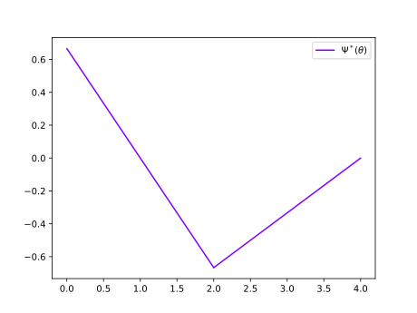

Flexibility Analysis
====================

In this example we will show how multiparametric programming can be used to solve a flexibility problem using PPOPT. This example is  from 'Active Constraint Strategy For Flexible Analysis in Chemical Processes' by Grossmann and Floudas. This is in effect a particular instance of using multiparametric programming to solve a bilevel optimization problem.

The general statement of Flexibility Analysis can be stated as follows. Where we are trying to minimize the maximum values of our :math:`f_j` constraints. Where if :math:`\chi \leq 0`, then the process is flexible in that it can adapt without violating any operational constraints for any realization of uncertainty that we are considering. If this statement is not true, then there is a realization of uncertainty that the system cannot mitigate with the control actions :math:`z`, and lead to operational violations.

.. math::

    \begin{align}
        \Psi &= \min_{z}\max_{j\in\mathcal{J}}\{\dots, f_j, \dots \}\\
        \chi &= \max_\theta \Psi(\theta)
    \end{align}

The lower level min-max problem can be reformulated into the following mathematical problem, where we have introduced an auxiliary variable :math:`u`. Where if for every realization of uncertainty :math:`\theta`, there are a control variables :math:`z` that allows us to satisfy :math:`u \leq 0` then we can say a process is flexible to this uncertainty.

.. math::

    \begin{align}
        \Psi(\theta) = \quad  \min_{z,u} &\quad u\\
        \text{s.t.} \quad f_j(z,\theta) \leq &u, \quad \forall j \in \mathcal{J}\\
        \theta &\in \Theta
    \end{align}

For the problem we are looking at here, our problem takes the following form. We have three constraints, one control variable :math:`z`, and one uncertainty :math:`\theta`.

.. math::
    \begin{align}
        \Psi = \min_{z,u} u\\
        \text{s.t.} \quad  z - u&\leq \theta\\
     -z  -u &\leq- \frac{4}{3} + \frac{1}{3}\theta\\
    z -u &\leq 4 -\theta\\
        -\theta &\leq 0\\
        \theta &\leq 4
    \end{align}

Using the ``MPModeler`` interface we can write the multiparametric program.

.. code:: python

    from ppopt.mpmodel import MPModeler

    # make a mpp modeler
    m = MPModeler()

    # add variables and parameter
    u = m.add_var(name='u')
    z = m.add_var(name='z')
    t = m.add_param(name='t')

    # add operability constraints
    m.add_constr(z - u <= t)
    m.add_constr(-z - u <= -4.0/3.0 + t/3)
    m.add_constr(z - u <= 4 - t)

    # add constraints on the uncertainty
    m.add_constr(t <= 4)
    m.add_constr(t >= 0)

    # set objective
    m.set_objective(u)

    # formulate the model
    prob = m.formulate_problem()

We can now solve the formulated multiparametric program, here we will solve it with the geometric algorithm. This will allow us to generate the explicit representation of the flexibility function with respect to :math:`\theta`.

.. code:: python

    from ppopt.mp_solvers.solve_mpqp import solve_mpqp, mpqp_algorithm

    sol = solve_mpqp(prob, mpqp_algorithm.geometric)

Now we can plot the explicit solution flexibility function. We can visually see here that this process is NOT flexible to the entire range of uncertainty, as for some :math:`\theta` realizations it is above zero.

.. code:: python

    from src.ppopt.plot import parametric_plot_1D

    parametric_plot_1D(sol, legend=[r'$\Psi^*(\theta)$'], plot_subset=[0])

However, this is not generally a good way to validate that the process is flexible for the entire range of uncertainty. Here what we can do is find the maximum of the objective function over the explicit solution with the following code, which will give us the exact value of :math:`\Psi`. If the maximum value of :math:`\Psi > 0`, then we know that the process is NOT flexible for the entire range of uncertainty. As a note, this code is specialized for the one parameter case but multidimensional generalization of this are direct.

.. code:: python

    from ppopt.utils.mpqp_utils import get_bounds_1d
    import numpy

    def get_max_obj_1d(sol, cr) -> float:
        # find the lower and upper bounds of the region
        min_theta, max_theta = get_bounds_1d(cr.E, cr.f)

        # find the objective at the bounds
        J_min = sol.evaluate_objective(numpy.array([[max_theta]]))
        J_max = sol.evaluate_objective(numpy.array([[min_theta]]))

        # return the largest objective
        return max(J_max, J_min)

    # find the largest objective (e.g. u) over the uncertainty space
    chi = max(map(lambda x: get_max_obj_1d(sol, x), sol.critical_regions))

If we run this code, we get that it evaluates to :math:`\chi = \frac{2}{3}`, meaning that the process is not flexible for the entire range of uncertainty.
