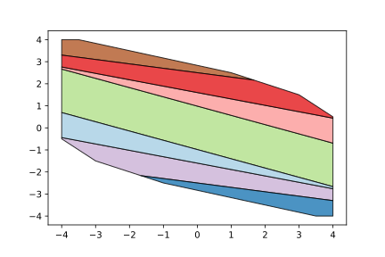
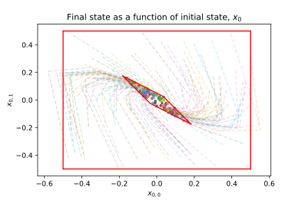

Explicit MPC
============

Explicit model predictive control (eMPC), alternatively referred to as multiparametric model predictive control (mpMPC) is the practice of recasting a control problem as a multiparametric program (mpp), then solving this mpp explicitly for all realizations of the uncertain parameters. The purpose of this is that, with the explicit solution in hand, one simply needs to evaluate the explicit solution for this realization (in control this is typically the state, :math:`x`, or setpoints, :math:`y_{\text{sp}}`) and one recovers the optimal input action(s) to apply to the system (typically denoted as :math:`u`). In this page, we will show the steps to reformulate a typically mpc application into a mpMPC and then solve it.

In this example, we will produce an explicit controller for the discretized double integrator system, as seen below. In control, the uncertain parameters come quite naturally from the problem definition itself as we do not know what the state of the system is before the system realizes itself or we measure it. As such the parametric variables that we are going to use for this example are :math:`x_{0,0}` and :math:`x_{0,1}`, meaning both components of the initial state of the system, :math:`x_{0}`.

.. math::

	\begin{matrix} x_{t+1} = Ax_t + Bu_t  &\rightarrow x_{t+1} = \begin{bmatrix} 1 & 1\\ 0 & 1\end{bmatrix}x_t + \begin{bmatrix} 0.5\\ 1\end{bmatrix}u_t\end{matrix}

In effect we would like to state the following mpc problem as a multiparametric problem. Where :math:`Q = \mathbf{I}_2`, :math:`R = 1`, and :math:`N` is the control horizon of 3. Here :math:`\bar{u} = 1`, :math:`\underline{u} = -1`, and :math:`\bar{x} = -\underline{x} = \begin{bmatrix} 4\\ 4\end{bmatrix}`

.. math::

    \begin{align}
	\min_{u, x} \quad \frac{1}{2}\sum_{t = 1}^N&{x_t^TQx_t} + \frac{1}{2}\sum_{t = 0}^{N-1}{u_t^TRu_t}\\
	\text{s.t. } x_{t+1} &= Ax_t + Bu_t, \quad \forall t \in {0, \dots, N-1}\\
	\underline{u} \leq &u_t \leq \bar{u}, \quad \forall t \in {0, \dots, N-1}\\
    \underline{x} \leq &x_t \leq \bar{x}, \quad \forall t \in {0, \dots, N}
    \end{align}

For ease of demonstration we will not eliminate the :math:`x` variables (which is very common and in some instances necessary to maintain positive definiteness of the resulting problems hessian). The first thing to do is to write the system dynamics as equalities.

.. math::

    \begin{bmatrix}
    \mathbf{I} &0&0&B&0&0\\
    -A&\mathbf{I}&0&0&B&0\\
    0&-A&\mathbf{I}&0&0&B
    \end{bmatrix}\begin{bmatrix}x_1\\x_2\\x_3\\u_0\\u_1\\u_2\end{bmatrix} = \begin{bmatrix}A\\0\\0\end{bmatrix}x_0

We can rewrite the inequalities for the decision variables and uncertain parameters as follows.

.. math::

    \begin{matrix}
    \begin{bmatrix}
    \mathbf{I} &0&0&0&0&0\\
    0&\mathbf{I} &0&0&0&0\\
    0&0&\mathbf{I} &0&0&0\\
    0&0&0&\mathbf{I} &0&0\\
    0&0&0&0&\mathbf{I}&0\\
    0&0&0&0&0&\mathbf{I}\\
    -\mathbf{I} &0&0&0&0&0\\
    0&-\mathbf{I} &0&0&0&0\\
    0&0&-\mathbf{I} &0&0&0\\
    0&0&0&-\mathbf{I} &0&0\\
    0&0&0&0&-\mathbf{I}&0\\
    0&0&0&0&0&-\mathbf{I}\\
    \end{bmatrix}\begin{bmatrix}x_1\\x_2\\x_3\\u_0\\u_1\\u_2\end{bmatrix} \leq \begin{bmatrix}\bar{x}\\ \bar{x} \\ \bar{x}\\ \bar{u}\\ \bar{u}\\ \bar{u}\\  -\underline{x}\\ -\underline{x} \\ -\underline{x}\\ -\underline{u}\\ -\underline{u}\\ -\underline{u} \end{bmatrix} & \begin{bmatrix} \mathbf{I}_2\\-\mathbf{I}_2\end{bmatrix}x_0 \leq \begin{bmatrix}\bar{x}\\ \underline{x}\end{bmatrix}\end{matrix}

As for the objective, we can inspect that the hessian of the reformulated problem is :math:`Q = \mathbf{I}_{9}`. An exercise left to the reader is to show that this is in fact true.

.. math::

    \frac{1}{2}\sum_{t = 1}^N&{x_t^TQx_t} + \frac{1}{2}\sum_{t = 0}^{N-1}{u_t^TRu_t} = \frac{1}{2} \begin{bmatrix}x_1\\x_2\\x_3\\u_0\\u_1\\u_2\end{bmatrix}^T\mathbf{I}_9 \begin{bmatrix}x_1\\x_2\\x_3\\u_0\\u_1\\u_2\end{bmatrix}

With all of this done, we are able to write down the mpMPC problem. People familiar with optimal control will see that this is not all together that different from setting up any other MPC problem.

.. code:: python

    import numpy
    from ppopt.mpqp_program import MPQP_Program

    # define the matrices for the double integrator
    A_ss = numpy.array([[1, 1], [0, 1]])
    B_ss = numpy.array([[0.5], [1]])

    # define the upper and lower bounds of the operating space
    x_upper = numpy.array([[4], [4]])
    x_lower = -x_upper

    u_upper = numpy.array([[1]])
    u_lower = -u_upper

    # make some auxiliary variables to simply the formulating the problem
    I_2 = numpy.eye(2)
    Z_2 = 0.0 * I_2
    Z_u = 0 * B_ss

    # write the equality constraints
    A_eq = numpy.block([[I_2, Z_2, Z_2, B_ss, Z_u, Z_u],
                        [-A_ss, I_2, Z_2, Z_u, B_ss, Z_u],
                        [Z_2, -A_ss, I_2, Z_u, Z_u, B_ss]])

    b_eq = numpy.zeros((6, 1)).reshape(-1, 1)
    F_eq = numpy.block([[A_ss], [Z_2], [Z_2]])

    # write the inequality constraints
    A_ineq = numpy.block([[numpy.eye(9)], [-numpy.eye(9)]])

    b_ineq = numpy.block(
        [[x_upper], [x_upper], [x_upper], [u_upper], [u_upper], [u_upper], [-x_lower], [-x_lower], [-x_lower], [-u_lower],
         [-u_lower], [-u_lower]])

    F_ineq = numpy.zeros((18, 2))

    # write the constraints on the parametric space
    A_t = numpy.block([[I_2], [-I_2]])
    b_t = numpy.block([[x_upper], [-x_lower]])

    # write the objective terms
    Q = numpy.eye(9)
    c = numpy.zeros((9, 1))
    H = numpy.zeros((9, 2))

    # combine the equality and inequality constraints
    A = numpy.block([[A_eq], [A_ineq]])
    b = numpy.block([[b_eq], [b_ineq]])
    F = numpy.block([[F_eq], [F_ineq]])

    # use ppopt to build the mpqp problem object
    mpmpc = MPQP_Program(A, b, c, H, Q, A_t, b_t, F, equality_indices=list(range(6)))

    # process constraints
    mpmpc.process_constraints()

The hardest parts are now over, as this is now just an mpQP (multiparametric Quadratic program) we can solve it with any of the mpQP algorithms offered in ``ppopt``. This can be accomplished with the following code. Here we are using the combinatorial algorithm, but any of the other algorithms can be accessed by changing ``mpqp_algorithm.combinatorial`` accordingly. On modern computers, this should solve in under a second.

.. code:: python

    from ppopt.mp_solvers.solve_mpqp import solve_mpqp, mpqp_algorithm

    sol = solve_mpqp(mpmpc, mpqp_algorithm.combinatorial)

A plot of the solution can be seen via the plotting utilities included in ``ppopt``. Here, we can see that all initial states, :math:`x_0` are not feasible and thus our solution does not extend over the box as originally posed.

.. code:: python

    from ppopt.plot import parametric_plot

    parametric_plot(sol)

Now that the full explicit solution is calculated, we can evaluate the solution instead of solving an optimization problem online, and do some post-analysis.

For example one can ask what the sensitivity of the output of the initial states are on the final states and input actions that the MPC predicts and gives. A benefit of multiparametric programming is that as we know the final state, :math:`x_3`, as a function of :math:`x_0`. We know that this function from the explicit solution so we can reconstruct exactly the space of possible final states, instead of needing to sample it. Here, we sample states from a rectangle around :math:`x_0 = (0,0)`, and compare how this fits into the space of predicted outputs from the multiparametric solution.

.. code:: python

    import matplotlib.pyplot as plt

    # generate random samples inside of the region of interest
    num_samples = 100
    perts = (numpy.random.rand(num_samples, 2) - 0.5)
    center = numpy.array([[0.0], [0.0]]).T
    samples = perts + center

    # get the optimal solution from the explicit map
    outputs = list(map(lambda i: sol.evaluate(samples[i].reshape(-1, 1)), range(num_samples)))

    # plot the state trajectories
    for i in range(num_samples):
        plt.plot([samples[i][0], outputs[i][0], outputs[i][2], outputs[i][4]],
                 [samples[i][1], outputs[i][1], outputs[i][3], outputs[i][5]], linestyle='dashed', alpha=0.2)
        plt.scatter([outputs[i][4]], [outputs[i][5]], alpha=1, marker='.')

    # the vertices of the sampled space in x_0
    vertices = [numpy.array([[.5], [0.5]]), numpy.array([[-.5], [0.5]]), numpy.array([[-.5], [-0.5]]), numpy.array(
        [[.5], [-0.5]]), numpy.array([[.5], [0.5]])]

    # project the vertices into the final state x_3 to build the bounds of where the final state can be
    cr = sol.get_region(numpy.array([[0], [0]]))
    find_extend = lambda x: cr.A[4:6, :] @ x + cr.b[4:6]
    transformed_verts = numpy.block(list(map(find_extend, vertices)))

    # plot the possible final states for this uncertainty problem
    plt.plot(transformed_verts[0], transformed_verts[1], color='red')

    # draw the sample box
    plt.plot([.5, .5], [-.5, .5], color='red')
    plt.plot([.5, -0.5], [.5, 0.5], color='red')
    plt.plot([.5, -.5], [-.5, -.5], color='red')
    plt.plot([-.5, -.5], [.5, -.5], color='red')

    # info for the plot
    plt.title(r'Final state as a function of initial state, $x_0$')
    plt.xlabel(r'$x_{0,0}$')
    plt.ylabel(r'$x_{0,1}$')

