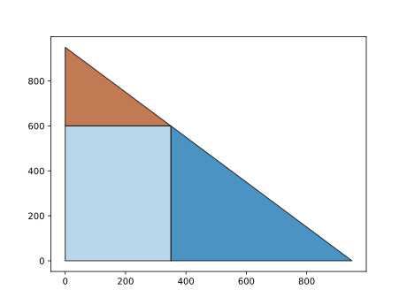

Solving a MPLP Program
======================

Here we are going to solve a classic transportation problem with multiparametric uncertainty. We have a set of plants and a set of markets with corresponding supplies and demand, and we want to minimize the transport cost between the plants, ensuring we satisfy all market demand. The multiparametric formulation is fleshed out in more detail in Multiparametric Optimization and Control by Pistikopolous, Diangelakis, and Oberdieck. This is the mpLP version of introductory mpQP problem, and shows how to solve an mpLP problem.

This optimization problem leads to the following multiparametric optimization problem, with θ representing the markets' uncertain demands. Here we are using a linear cost formulation in the objective

.. math::
    \min_{x} \left[\begin{matrix}178.0\\187.0\\187.0\\151.0\end{matrix}\right]^T\left[\begin{matrix}x_0\\x_1\\x_2\\x_3\end{matrix}\right]

.. math::
    \begin{equation*}
    \begin{split}
    \text{s.t. }\left[\begin{matrix}1.0 & 1.0 & 0 & 0\\0 & 0 & 1.0 & 1.0\\-1.0 & 0 & -1.0 & 0\\0 & -1.0 & 0 & -1.0\\-1.0 & 0 & 0 & 0\\0 & -1.0 & 0 & 0\\0 & 0 & -1.0 & 0\\0 & 0 & 0 & -1.0\end{matrix}\right]\left[\begin{matrix}x_0\\x_1\\x_2\\x_3\end{matrix}\right] & \leq\left[\begin{matrix}350.0\\600.0\\0\\0\\0\\0\\0\\0\end{matrix}\right]+\left[\begin{matrix}0 & 0\\0 & 0\\-1.0 & 0\\0 & -1.0\\0 & 0\\0 & 0\\0 & 0\\0 & 0\end{matrix}\right]\left[\begin{matrix}\theta_0\\\theta_1\end{matrix}\right]\\
    \left[\begin{matrix}1.0 & 0\\0 & 1.0\\-1.0 & 0\\0 & -1.0\end{matrix}\right]\left[\begin{matrix}\theta_0\\\theta_1\end{matrix}\right] & \leq\left[\begin{matrix}1e+03\\1e+03\\0\\0\end{matrix}\right]
    \end{split}
    \end{equation*}

Using PPOPT, this is translated as the following python code. (The latex above was generated for me with ``prog.latex()`` if you were wondering if I typed that all out by hand.)

.. code:: python

    import numpy
    from ppopt.mpqp_program import MPLP_Program

    A = numpy.array([[1, 1, 0, 0], [0, 0, 1, 1], [-1, 0, -1, 0], [0, -1, 0, -1], [-1, 0, 0, 0], [0, -1, 0, 0], [0, 0, -1, 0], [0, 0, 0, -1]])
    b = numpy.array([350, 600, 0, 0, 0, 0, 0, 0]).reshape(8, 1)
    c = numpy.array([178, 187, 187, 151]).reshape(-1,1)
    F = numpy.array([[0, 0], [0, 0], [-1, 0], [0, -1], [0, 0], [0, 0], [0, 0], [0, 0]])
    CRa = numpy.vstack((numpy.eye(2), -numpy.eye(2)))
    CRb = numpy.array([1000, 1000, 0, 0]).reshape(4, 1)
    H = numpy.zeros((A.shape[1],F.shape[1]))

    prog = MPLP_Program(A, b, c, H, CRa, CRb, F)

But before you go forward and solve this, I would always recommend processing the constraints. Removing all strongly and weakly redundant constraints and rescaling them leads to significant performance increases and robustifying the numerical stability. In PPOPT, processing the constraints is a simple task.

.. code:: python

    prog.process_constraints()

This results in the following (identical) multiparametric optimization problem. In general removing constraints can exponentially reduce the time to solve explicitly.

.. math::
    \min_{x} \left[\begin{matrix}178.0\\187.0\\187.0\\151.0\end{matrix}\right]^T\left[\begin{matrix}x_0\\x_1\\x_2\\x_3\end{matrix}\right]

.. math::
    \begin{equation*}
    \begin{split}
    \text{s.t. }\left[\begin{matrix}0.7071 & 0.7071 & 0 & 0\\0 & 0 & 0.7071 & 0.7071\\-0.5774 & 0 & -0.5774 & 0\\0 & -0.5774 & 0 & -0.5774\\-1.0 & 0 & 0 & 0\\0 & -1.0 & 0 & 0\\0 & 0 & -1.0 & 0\\0 & 0 & 0 & -1.0\end{matrix}\right]\left[\begin{matrix}x_0\\x_1\\x_2\\x_3\end{matrix}\right] & \leq\left[\begin{matrix}247.5\\424.3\\0\\0\\0\\0\\0\\0\end{matrix}\right]+\left[\begin{matrix}0 & 0\\0 & 0\\-0.5774 & 0\\0 & -0.5774\\0 & 0\\0 & 0\\0 & 0\\0 & 0\end{matrix}\right]\left[\begin{matrix}\theta_0\\\theta_1\end{matrix}\right]\\
    \left[\begin{matrix}1.0 & 0\\0 & 1.0\\-1.0 & 0\\0 & -1.0\end{matrix}\right]\left[\begin{matrix}\theta_0\\\theta_1\end{matrix}\right] & \leq\left[\begin{matrix}1e+03\\1e+03\\0\\0\end{matrix}\right]
    \end{split}
    \end{equation*}

That wasn't that bad, and we were able to cut away some constraints that didn't matter in the process! Now we are ready to solve it. We import the solver functionalities and then specify an algorithm to use. Here we are specifying the combinatorial algorithm. Even though we are using the ``solve_mpqp`` function, this is also the main backend to solve mpLPs!

.. code:: python

    from ppopt.mp_solvers.solve_mpqp import solve_mpqp, mpqp_algorithm
    solution = solve_mpqp(prog, mpqp_algorithm.combinatorial)

Now we have the solution, we can either export the solution via the micropop module, or we can plot it. Let's plot it here. The extra arguments mean we are saving a picture of the plot and displaying it to the user (you can give a file path, so it saves somewhere that is not the current working directory).

.. code:: python

    from ppopt.plot import parametric_plot

    # saves the plot as 'transport.svg' in the current working directory
    parametric_plot(solution, save_path='transport_mplp', save_format='svg', show=True)

