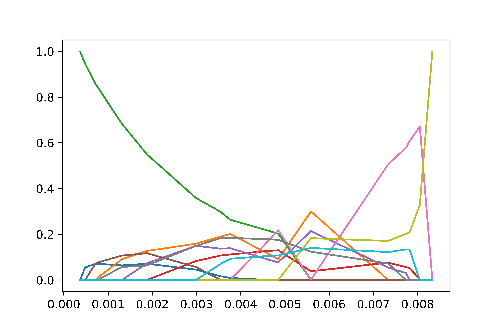

Markowitz Portfolio Allocation
==============================

The `Markowitz portfolio optimization <https://en.wikipedia.org/wiki/Modern_portfolio_theory>`_ problem is given as follows, where :math:`\Sigma` is the covariance of the commodities. In this example, we are considering only positive definite covariance matrices. :math:`R^*` is the return we wish to get, :math:`\mu` is the expected rate of return. The constraints are effectively specifying a return rate that we want, saying that the composition of our portfolio must sum to one (we only have one portfolio!) and that we can't have negative positions in any commodity.

.. math::
    \begin{align}
    \min \frac{1}{2} w^T & \Sigma w\\
    \sum \mu_i w_i &=R^* \\
    \sum w_i &= 1\\
    w_i &\geq 0, \forall i
    \end{align}

This can be reformulated into an mpQP, or to say we can solve this for all possible realizations of our desired return and recover the Pareto front by switching out $R^* $ with an uncertain parameter $\theta$. Since there is only one uncertain dimension, the geometric algorithm is the most efficient for this problem, and even portfolios with hundreds of commodities can be solved in seconds. However since, trying to plot the optimal portfolio positions for hundreds of commodities, we instead are going to solve it for five commodities so we can still see what is happening under the hood.

Here the covariance matrix and the return coefficients were generated from random numbers as I do not have easy access to this sort of data (I got lazy). I followed YALMIPS suggestions on generating reasonable enough data from random numbers.

.. code-block:: python

    numpy.random.seed(123456789)
    num_assets = 10
    S = numpy.random.randn(num_assets,num_assets)
    S = S@S.T / 10
    mu = numpy.random.rand(num_assets)/100

Here is the problem that we are going to be tackling in this post. Some of the constraints have been noticeably modified. This is due to a standard preprocessing pass from the solver that I am using. This modification increases numerical stability for ill-conditioned optimization problems but has nearly no effect in this case.

.. code-block:: python

    import numpy
    from ppopt.mpqp_program import MPQP_Program

    A = numpy.block([[1 for i in range(num_assets)],[mu[i] for i in range(num_assets)],[-numpy.eye(num_assets)]])
    b = numpy.array([1,0,*[0 for i in range(num_assets)]]).reshape(-1,1)
    F = numpy.block([[0],[1],[numpy.zeros((num_assets,1))]])
    A_t = numpy.array([[-1],[1]])
    b_t = numpy.array([[-min(mu)],[max(mu)]])
    Q = S
    c = numpy.zeros((num_assets,1))
    H = numpy.zeros((A.shape[1],F.shape[1]))
    portfolio = MPQP_Program(A, b, c, H, Q, A_t, b_t, F,equality_indices= [0,1])

Now that we have formulated the mpQP, all we have to do is solve it. Which can be accomplished in with the following python code. We are using the geometric algorithm here, as it is very fast in this type of problem. For this problem it only took half a second to solve.

.. code-block:: python

    from ppopt.mp_solvers.solve_mpqp import solve_mpqp, mpqp_algorithm

    sol = solve_mpqp(portfolio, mpqp_algorithm.geometric)

To plot the parametric solution of commodities that we should invest in as a function of return, we can just use the inbuilt plotting functionality.

.. code-block:: python

    from ppopt.plot import parametric_plot_1D

    parametric_plot_1D(sol)

That is fine an good an all, but typically we want to view how this effects the balance of risk and reward. Here we can see the classical shape of the risk-reward tradeoff. The pareto front of all portfolios is completely recovered and is algebraic form.

.. code-block:: python

    import matplotlib.pyplot as plt

    returns = numpy.linspace(min(mu)+ .00001,max(mu) - .000001,1000)
    risk = numpy.array([sol.evaluate_objective(numpy.array([[x]])) for x in returns]).flatten()

    plt.title('Optimal risk v. return pareto front')
    plt.xlabel('Risk')
    plt.ylabel('Return')
    plt.plot(risk,returns)

.. image:: risk_return_port.svg
